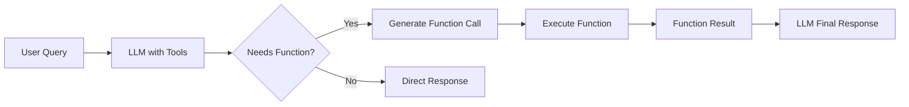

# LiteLLM Tool Calling: From Python Functions to Tool Schemas

This document explains how Python functions are converted into tool schemas for LiteLLM tool calling, comparing manual and automatic approaches.

Note: While the feature is still called "Function Calling" by OpenAI and other providers, the modern API uses the `tools` parameter instead of the deprecated `functions` parameter.

## Overview

Function calling allows LLMs to invoke specific functions when they need to perform calculations, fetch data, or execute actions. The model receives function definitions in a structured JSON format and can decide when and how to call them.

## The Tool Schema Structure

Every function tool follows this standard OpenAI format:

```json
{
  "type": "function",
  "function": {
    "name": "function_name",
    "description": "What the function does",
    "parameters": {
      "type": "object",
      "properties": {
        "param1": {
          "type": "string|number|boolean",
          "description": "What this parameter does"
        }
      },
      "required": ["param1"]
    }
  }
}
```

## Method 1: Manual Dictionary Creation

### Python Function
```python
def sum_numbers(a, b):
    """Add two numbers together."""
    return a + b
```

### Manual Schema Creation
You manually create the entire JSON schema:

```python
manual_schema = {
    "type": "function",
    "function": {
        "name": "sum_numbers",                           # ← Function name
        "description": "Add two numbers together and return the sum",  # ← Manual description
        "parameters": {
            "type": "object",
            "properties": {
                "a": {                                   # ← Parameter name from function signature
                    "type": "number",                    # ← Manual type specification
                    "description": "The first number to add"  # ← Manual description
                },
                "b": {                                   # ← Parameter name from function signature
                    "type": "number",                    # ← Manual type specification
                    "description": "The second number to add"  # ← Manual description
                }
            },
            "required": ["a", "b"]                       # ← Manual specification of required params
        }
    }
}
```

**Mapping Process:**
1. **Function name** → `function.name`
2. **Manual description** → `function.description`
3. **Parameter names** → `parameters.properties.{param_name}`
4. **Manual type guessing** → `parameters.properties.{param}.type`
5. **Manual descriptions** → `parameters.properties.{param}.description`
6. **Manual required list** → `parameters.required`

## Method 2: function_to_dict (Automatic)

### Python Function with Docstring
```python
def sum_numbers(a: float, b: float) -> float:
    """Add two numbers together and return the sum
    
    Parameters
    ----------
    a : float
        The first number to add
    b : float
        The second number to add
    
    Returns
    -------
    float
        The sum of the two numbers
    """
    return a + b
```

### Automatic Schema Generation
Simply call:
```python
auto_schema = litellm.utils.function_to_dict(sum_numbers)
```

**Automatic Mapping Process:**
1. **Function name** → `function.name` (from `sum_numbers.__name__`)
2. **Docstring first line** → `function.description` (from `"""Add two numbers together and return the sum`)
3. **Type hints** → `parameters.properties.{param}.type` (from `a: float` → `"number"`)
4. **Docstring Parameters section** → `parameters.properties.{param}.description` (from numpy-style docstring)
5. **All typed parameters** → `parameters.required` (automatically inferred)

## Detailed Mapping Example

Let's trace how this function:

```python
def get_current_weather(location: str, unit: str = "fahrenheit") -> str:
    """Get the current weather for a specific location
    
    Parameters
    ----------
    location : str
        The city and state, e.g. San Francisco, CA
    unit : str {'celsius', 'fahrenheit'}
        The temperature unit to use
    
    Returns
    -------
    str
        A description of the current weather
    """
    temp = 72 if unit == "fahrenheit" else 22
    return f"Weather in {location}: {temp}°{unit[0].upper()}, sunny"
```

Gets converted to:

```json
{
  "name": "get_current_weather",                    // ← from function.__name__
  "description": "Get the current weather for a specific location",  // ← from docstring first line
  "parameters": {
    "type": "object",
    "properties": {
      "location": {                                 // ← from parameter name
        "type": "string",                           // ← from type hint: str
        "description": "The city and state, e.g. San Francisco, CA"  // ← from docstring Parameters section
      },
      "unit": {                                     // ← from parameter name
        "type": "string",                           // ← from type hint: str
        "enum": ["celsius", "fahrenheit"],          // ← from docstring: {'celsius', 'fahrenheit'}
        "description": "The temperature unit to use"  // ← from docstring Parameters section
      }
    },
    "required": ["location"]                        // ← "unit" has default value, so not required
  }
}
```

## Type Mapping Rules

| Python Type | JSON Schema Type |
|-------------|------------------|
| `str` | `"string"` |
| `int`, `float` | `"number"` |
| `bool` | `"boolean"` |
| `List[str]` | `"array"` with `items: {"type": "string"}` |
| Optional params (with defaults) | Not included in `required` |

## Docstring Format Requirements

For `function_to_dict` to work properly, use **numpy-style docstrings**:

```python
def my_function(param1: type, param2: type = default) -> return_type:
    """Brief description of what the function does
    
    Parameters
    ----------
    param1 : type
        Description of param1
    param2 : type {option1, option2}  # Optional: specify enum values
        Description of param2
    
    Returns
    -------
    return_type
        Description of return value
    """
```

## Comparison: Manual vs Automatic

| Aspect | Manual | function_to_dict |
|--------|--------|------------------|
| **Lines of code** | 20+ lines per function | 1 line per function |
| **Maintenance** | Update in 2 places | Update only docstring |
| **Error-prone** | High (typos, missing fields) | Low (automated) |
| **Type safety** | Manual guessing | Uses actual type hints |
| **Documentation** | Separate from code | Integrated with code |
| **Enum support** | Manual enum arrays | Automatic from docstring |

## How the LLM Uses These Schemas

1. **Function Selection**: The LLM reads `function.description` to understand what each function does
2. **Parameter Understanding**: Uses `parameters.properties.{param}.description` to understand each parameter
3. **Type Validation**: Uses `parameters.properties.{param}.type` to generate correct JSON
4. **Required Check**: Uses `parameters.required` to know which parameters are mandatory
5. **Enum Constraints**: Uses `parameters.properties.{param}.enum` to pick valid options

## Function Execution Flow



## Best Practices

1. **Use type hints** - Enables automatic type mapping
2. **Write good docstrings** - LLM uses descriptions to make decisions
3. **Use descriptive parameter names** - Helps LLM understand purpose
4. **Specify enums in docstrings** - Constrains LLM to valid options
5. **Use function_to_dict** - Less error-prone and more maintainable

## Example: Complete Workflow

```python
# 1. Define function with proper docstring
def calculate_tip(bill_amount: float, tip_percentage: float = 15.0) -> float:
    """Calculate tip amount for a bill
    
    Parameters
    ----------
    bill_amount : float
        The total bill amount in dollars
    tip_percentage : float
        The tip percentage (default 15%)
    
    Returns
    -------
    float
        The tip amount in dollars
    """
    return bill_amount * (tip_percentage / 100)

# 2. Convert to tool schema
tool = {"type": "function", "function": litellm.utils.function_to_dict(calculate_tip)}

# 3. LLM receives this schema:
{
  "type": "function",
  "function": {
    "name": "calculate_tip",
    "description": "Calculate tip amount for a bill",
    "parameters": {
      "type": "object", 
      "properties": {
        "bill_amount": {
          "type": "number",
          "description": "The total bill amount in dollars"
        },
        "tip_percentage": {
          "type": "number", 
          "description": "The tip percentage (default 15%)"
        }
      },
      "required": ["bill_amount"]  # tip_percentage is optional due to default
    }
  }
}

# 4. User asks: "What's the tip for a $50 bill?"
# 5. LLM generates: {"name": "calculate_tip", "arguments": {"bill_amount": 50}}
# 6. We execute: calculate_tip(50)  # Uses default tip_percentage=15.0
# 7. Result: 7.5
# 8. LLM responds: "The tip for a $50 bill would be $7.50 (at 15%)."
```

This automatic mapping from Python functions to tool schemas is what makes `function_to_dict` so powerful and developer-friendly!